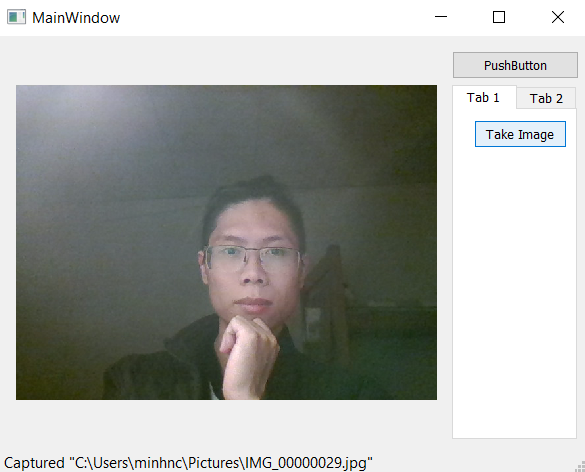

# Qt Widgets Camera



## Key techniques:
 - QCameraViewfinder auto resizes when window change size:
    + QCameraViewfinder must be display on its own `QCameraViewfinder` widget, which is extend from `QWidget` by `customwidget`(not displayed on common `QLabel` as usual)
    + customwidget QCameraViewfinder is contained in a QStackedWidget, this one must be resizeable also.
 - customwidgets: 
    + [Clickable_QLabel](https://wiki.qt.io/Clickable_QLabel): add on_clicked() event for QLabel
    + QCameraViewfinder: this one is not available in .ui, but available in Qt .Cpp

**How to**:
 - re-edit ui: left click the .ui file, select `Open With` -> `Plain Text Editor`
 - define new `customwidgets`:
```XML
	<customwidgets>
		<customwidget>
			<class>QCameraViewfinder</class>
			<extends>QWidget</extends>
			<header>qcameraviewfinder.h</header>
			<container>1</container>
		</customwidget>
		<customwidget>
			<class>QClickableLabel</class>
			<extends>QLabel</extends>
			<header>qclickablelabel.h</header>
			<container>1</container>
		</customwidget>
	</customwidgets>
```
 - to layout widgets, add:
```XML
<layout class="QGridLayout" name="gridLayout">
    <item row="1" column="1" colspan="2">
        <widget>...</widget>
    </item>
    <item row="1" column="1" rowspan="3">
        <widget>...</widget>
    </item>
    ...
</layout>
```
*`rowspan="3"` make item flexible, `colspan="2"` make the item column fixed*
