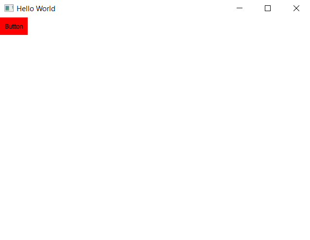

# Custom Button

## Guidance:
 - Create project `Qt Quick Application - Empty`

 - `Add New...`  `QML file(Qt Quick 2)`:

 - Code a custom button like below:

 - `main.qml` use custom button by the way below:

 - Result like below:

 - To make the button clickable, add `MouseArea` property and click event like below:

 - `main.qml` uses custom button like below:

 - When we run the app, click on the button, the application outputs result like below:

